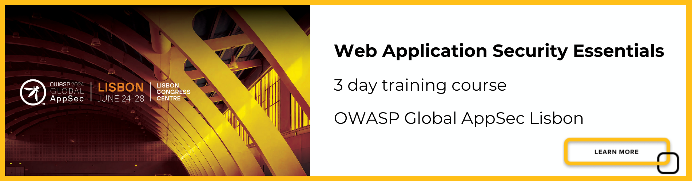

# Web Application Security Essentials

The Web Application Security Essentials course is a comprehensive and strategic overview of web application security and provides the knowledge and resources required to those responsible for implementing, managing, or protecting web applications.

This course is designed around the OWASP Top 10, serving as a standard awareness document for developers and web application security. It reflects a broad consensus on the most critical security risks to web applications. For more information, visit [OWASP Top 10](https://owasp.org/www-project-top-ten/).&#x20;

### The **Application Security Series** of training courses are specifically designed to help stakeholders identify, mitigate, and prevent security vulnerabilities throughout the Software Development Lifecycle.

[**OWASP 2024 Global AppSec Lisbon, June 24 - 28 2024** - Web application vulnerabilities can be exploited to access critical and confidential data. Join Fabio Cerullo at OWASP 2024 Global AppSec Lisbon for a highly interactive session on Web Application Security Essentials. ](https://cycubix.com/2024/03/13/owasp-2024-global-appsec-lisbon-june-24-28/)

<figure><figcaption></figcaption></figure>
