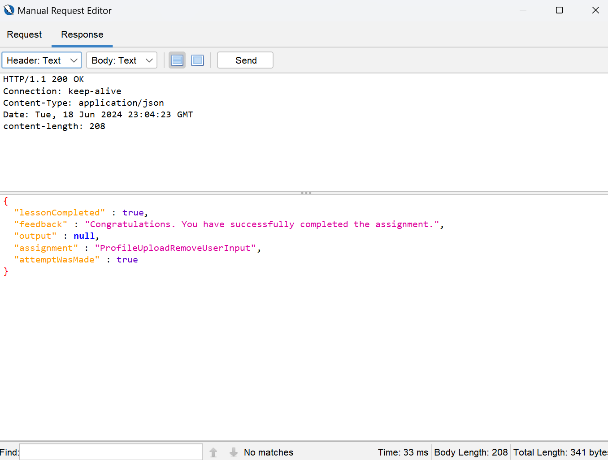

# A3:2021 | Path Transversal (4) | Cycubix Docs

#### Path traversal while uploading files 

The developer again became aware of the vulnerability by not validating the input of the `full name` input field. A fix was applied in an attempt to solve this vulnerability.

Again the same assignment, but can you bypass the implemented fix?

<figure><figcaption></figcaption></figure>

**Solution with ZAP**

* Hints: Take a look what happened to the file name. Can we still manipulate the request?. You can try to use a proxy to intercept the POST request. Try updating the profile WebGoat will display the location.&#x20;
* We will have to see then how we can bypass the implemented fix. In this case by adding the already known pattern from the previous exercises ../ we can find a way to bypass the fix.&#x20;

<figure><figcaption></figcaption></figure>

<figure><figcaption></figcaption></figure>

**Solution with BURP**

* Hint: Take a look what happened to the file name. You can try to use a proxy to intercept the POST request.&#x20;
* Open the Interceptor on Burp and find the POST request. You will see that the file name used to write the image to the disk is taken directly from the name of the file passed to the webapp. In this case is xss 2.png

<figure><figcaption></figcaption></figure>

* We can manipulate the request by adding ../ in front of the file name.&#x20;

<figure><figcaption></figcaption></figure>
