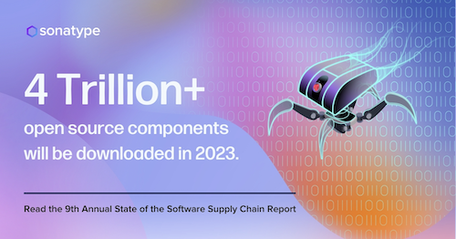

# A6:2021 | Vulnerable and Outdated Components (1) | Cycubix Docs

#### Concept

The way we build software has changed. The open source community is maturing, and the availability of open source software has become prolific without regard to determining the provenance of the libraries used in our applications. Ref: [Software Supply Chain](https://www.sonatype.com/state-of-the-software-supply-chain/introduction)

This lesson will walk through the difficulties with managing dependent libraries, the risk of not managing those dependencies, and the difficulty in determining if you are at risk.

**Figure: The continued growth of Open Source software.**

<figure><figcaption>
For more information visit <a href="https://www.sonatype.com/state-of-the-software-supply-chain/introduction">Sonatype</a>
</figcaption></figure>

#### Goals

* Gain awareness that the open source consumed is as important as your own custom code.
* Gain awareness of the management, or lack of management, in our open source component consumption.
* Understand the importance of a Bill of Materials in determining open source component risk.
