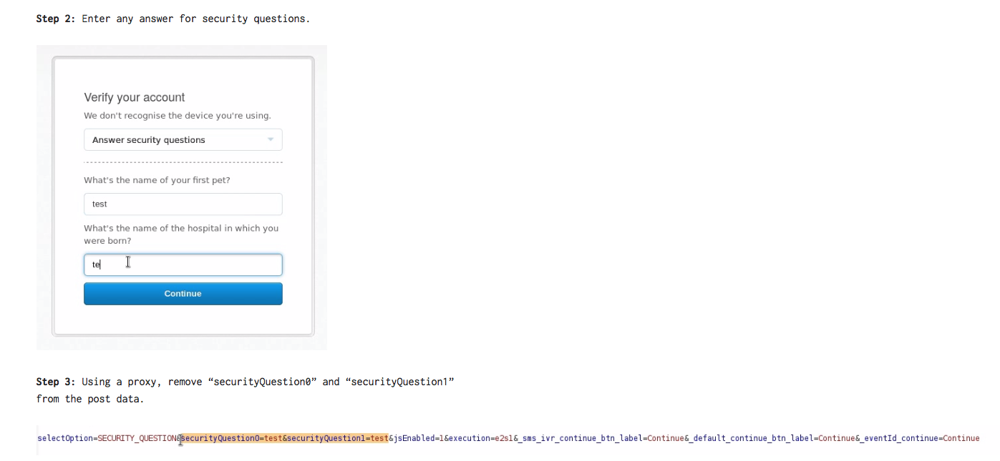
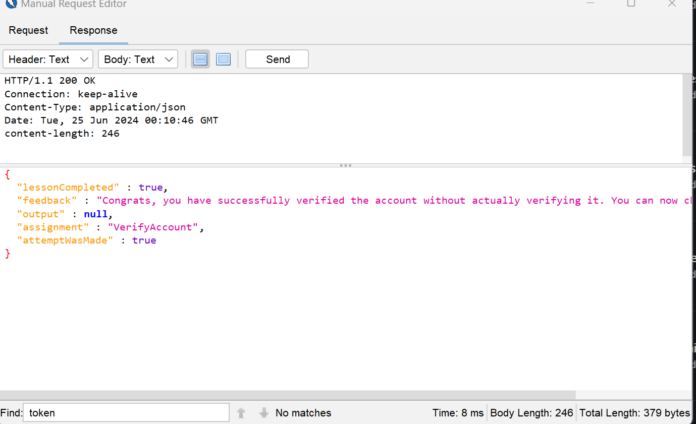

# A7:2021 | Authentication Bypasses (2) | Cycubix Docs

### 2FA Password Reset 

An excellent example of authentication bypass is a recent (2016) example ([https://henryhoggard.co.uk/blog/Paypal-2FA-Bypass](https://henryhoggard.co.uk/blog/Paypal-2FA-Bypass)). He could not receive an SMS with a code, so he opted for an alternative method, which involved security questions. Using a proxy, removed the parameters entirely and won.

<figure><figcaption></figcaption></figure>

\
The Scenario

You reset your password, but do it from a location or device that your provider does not recognize. So you need to answer the security questions you set up. The other issue is Those security questions are also stored on another device (not with you), and you don’t remember them.

You have already provided your username/email and opted for the alternative verification method.

<figure><figcaption></figcaption></figure>

**Solution**

* Hints: The attack on this is similar to the story referenced, but not exactly the same. You do want to tamper the security question parameters, but not delete them. The logic to verify the account does expect 2 security questions to be answered, but there is a flaw in the implementation. Have you tried renaming the secQuestion0 and secQuestion1 parameters?.&#x20;
* Since there is a flaw in the implementation and the hint is to rename the security question, let's start by intercepting the request on ZAP.&#x20;

<figure><figcaption></figcaption></figure>

* Let's send the request to the Manual Request Editor in ZAP or the Repeater on Burp. Then try renaming the security questions.&#x20;
* In this case we added one 0 to security question0 and added a 1 in security question1.&#x20;

<figure><figcaption></figcaption></figure>

<figure><figcaption></figcaption></figure>
