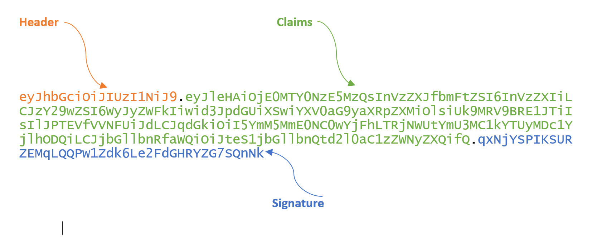
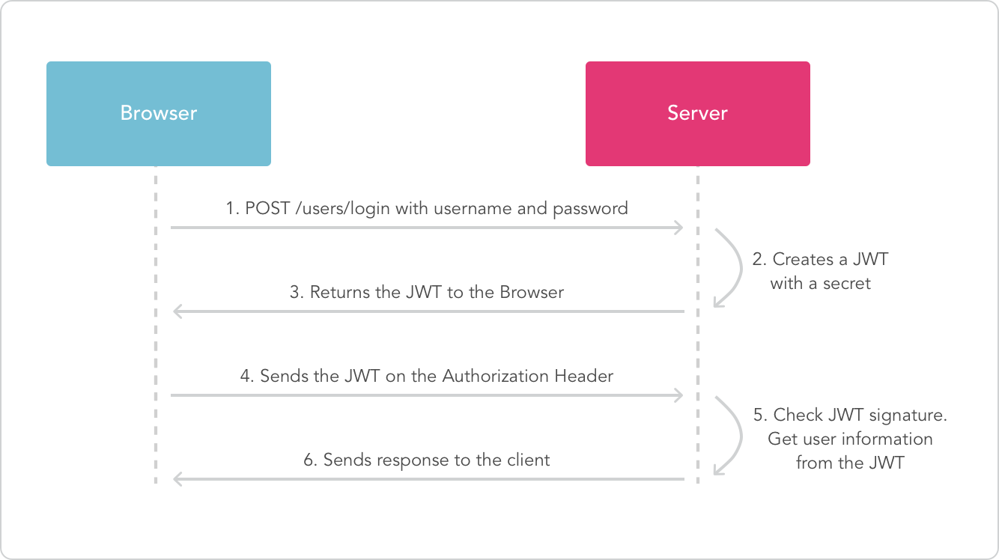

# A7: 2021 | JWT Tokens | Cycubix Docs

### Concept 

This lesson teaches about using JSON Web Tokens (JWT) for authentication and the common pitfalls you need to be aware of when using JWT.

### Goals 

Teach how to securely implement the usage of tokens and validation of those tokens.

### Introduction 

Many application use JSON Web Tokens (JWT) to allow the client to indicate is identity for further exchange after authentication.

From [https://jwt.io/introduction](https://jwt.io/introduction)

<figure><figcaption></figcaption></figure>

### Structure of a JWT token 

Let’s take a look at the structure of a JWT token:

<figure><figcaption></figcaption></figure>

The token is base64 encoded and consists of three parts:

* header
* claims
* signature

Both header and claims consist are represented by a JSON object. The header describes the cryptographic operations applied to the JWT and optionally, additional properties of the JWT. The claims represent a JSON object whose members are the claims conveyed by the JWT.

### JWT claim misuse 

JWT claim misuse refers to the improper or unauthorized manipulation of the claims within a JSON Web Token (JWT). A JWT is a compact and self-contained way to represent information between two parties. It consists of the header, the payload (claims), and the signature.

JWT claim misuse can happen in different ways:

* **Unauthorized claims**: A malicious user might try to add unauthorized claims to a JWT to gain access to certain features or resources they are not entitled to—for example, a regular user attempts to modify their JWT to claim administrator privileges.
* **Tampering claims**: An attacker might try to modify the values of existing claims in the JWT to manipulate their own identity or alter their permissions. For instance, they are changing the "user\_id" claim to impersonate a different user.
* **Excessive claims**: An attacker could try to include many unnecessary or fake claims in a JWT to increase the token size and possibly disrupt the system’s performance or cause other issues.
* **Expired or altered expiration claims**: If an attacker can modify the "exp" claim to extend the token’s expiration time, they can effectively gain access beyond their intended session.
* **Replay attacks**: An attacker might try to reuse a valid JWT from an old session to impersonate the original user or exploit time-limited functionality.
* **Key claim manipulation**: In some cases, the "kid" (key ID) claim may be misused, as explained in the previous answer. An attacker might try manipulating the "kid" claim to use a different key for signature verification.

To prevent JWT claim misuse, it is essential to implement proper validation and verification mechanisms on both the client and server sides. Validate the claims to ensure they are valid, authorized, and relevant to the user’s context. Additionally, always verify the signature of the JWT to ensure the token’s integrity and protect against tampering. Following best practices for JWT implementation, secure key management, and regular key rotation will also help mitigate the risk of JWT claim misuse.

In the following two sections, we will dive into some examples of header claim misuses to give you an idea of how they work and how to protect an application.

### Decoding a JWT token 

Let’s try decoding a JWT token, for this you can use the [JWT](http://127.0.0.1:9090/WebWolf/jwt) functionality inside WebWolf. Given the following token:

<figure><figcaption></figcaption></figure>

Copy and paste the following token and decode the token, can you find the user inside the token?

<figure><figcaption></figcaption></figure>

### Authentication and getting a JWT token 

A basic sequence of getting a token is as follows:

<figure><figcaption></figcaption></figure>

In this flow, you can see the user logs in with a username and password on successful authentication the server returns. The server creates a new token and returns this one to the client. When the client makes a successive call toward the server it attaches the new token in the "Authorization" header. The server reads the token and first validates the signature after a successful verification the server uses the information in the token to identify the user.

#### Claims 

The token contains claims to identify the user and all other information necessary for the server to fulfill the request. Be aware not to store sensitive information in the token and always send it over a secure channel.

### JWT signing 

Each JWT token should at least be signed before sending it to a client, if a token is not signed the client application would be able to change the contents of the token. The signing specifications are defined [here](https://tools.ietf.org/html/rfc7515) the specific algorithms you can use are described [here](https://tools.ietf.org/html/rfc7518) It basically comes down you use "HMAC with SHA-2 Functions" or "Digital Signature with RSASSA-PKCS1-v1\_5/ECDSA/RSASSA-PSS" function for signing the token.

#### Checking the signature 

One important step is to **verify the signature** before performing any other action, let’s try to see some things you need to be aware of before validating the token.

### Assignment 

Try to change the token you receive and become an admin user by changing the token and once you are admin reset the votes

<figure><figcaption></figcaption></figure>

#### Solution 

The idea behind this assignment is that you can manipulate the token which might cause the server to interpret the token differently. In the beginning when JWT libraries appeared they implemented the specification to the letter meaning that the library took the algorithm specified inside the header and tried to work with it.

> Signed JSON Web Tokens carry an explicit indication of the signing algorithm, in the form of the "alg" Header Parameter, to facilitate cryptographic agility. This, in conjunction with design flaws in some libraries and applications, has led to several attacks:
>
> * The algorithm can be changed to "none" by an attacker, and some libraries would trust this value and "validate" the JWT without checking any signature.
> * An "RS256" (RSA, 2048 bit) parameter value can be changed into "HS256" (HMAC, SHA-256), and some libraries would try to validate the signature using HMAC-SHA256 and using the RSA public key as the HMAC shared secret (see \[McLean] and \[CVE-2015-9235]).
>
> For mitigations, see Sections 3.1 and 3.2.

— https://tools.ietf.org/html/rfc8725#section-2.1

What basically happened was that libraries just parsed the token as it was given to them without validating what cryptographic operation was used during the creation of the token.

**Solution**

First note that we are logged in as `Guest` so first select a different user for example: Tom. User Tom is allowed to vote as you can see, but he is unable to reset the votes. Looking at the request this will return an `access_token` in the response:

<figure><figcaption></figcaption></figure>

Decoding the token gives:

<figure><figcaption></figcaption></figure>

We can change the `admin` claim to `false` but then signature will become invalid. How do we end up with a valid signature? Looking at the [RFC specification](https://tools.ietf.org/html/rfc7519#section-6.1) `alg: none` is a valid choice and gives an unsecured JWT. Let’s change our token:

<figure><figcaption></figcaption></figure>

If we use WebWolf to create our token we get:

<figure><figcaption></figcaption></figure>

Now we can replace the token in the cookie and perform the reset again. One thing to watch out for is to add a `.` at the end otherwise the token is not valid.

### References 

For more information take a look at the following video:

[https://www.youtube.com/watch?v=wt3UixCiPfo](https://www.youtube.com/watch?v=wt3UixCiPfo)

### Code review 

Now let’s look at a code review and try to think on an attack with the `alg: none`, so we use the following token:

<figure><figcaption></figcaption></figure>

which after decoding becomes:

<figure><figcaption></figcaption></figure>

<figure><figcaption></figcaption></figure>

<figure><figcaption></figcaption></figure>

Can you spot the weakness?

Submit answers

### Code review (2) 

Same as before but now we are only removing the signature part, leaving the algorithm as is.

