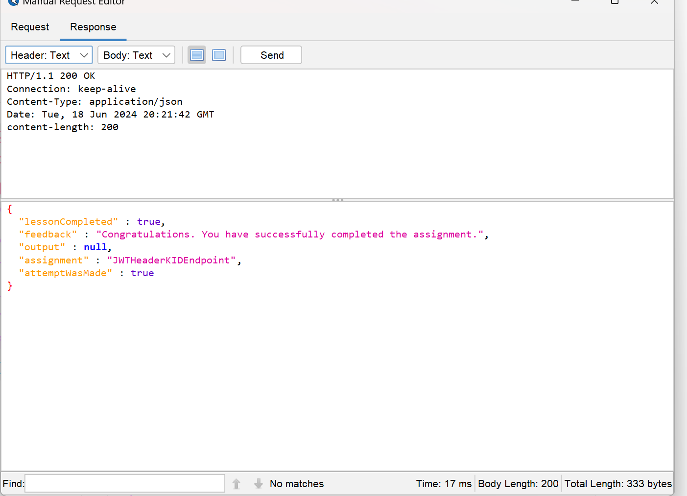

# A7: 2021 | JWT Tokens (16) | Cycubix Docs

### Try it out…​ 

Below you see two accounts, one of Jerry and one of Tom. Jerry wants to remove Tom’s account from Twitter, but his token can only delete his account. Can you try to help him and delete Toms account?

<figure><figcaption></figcaption></figure>

**Solution**

* Open ZAP breaker and intercept the POST request after pressing delete on Tom's  account.&#x20;

<figure><figcaption></figcaption></figure>

* You can also see the delete token in developer tools.&#x20;

<figure><figcaption></figcaption></figure>

* The request is a POST with a JWT token passed as a URL parameter (like a GET request). The token validation fails because the signature does not match the expected one, as indicated in the response and output JSON.

<figure><figcaption></figcaption></figure>

* Go ahead and change username, sub and email into Tom. Also change your actual timestamp in the following [link](https://www.epochconverter.com/).&#x20;

<figure><figcaption></figcaption></figure>

* As we analyze the headers, we can see that kid is used as an optional header claim which holds a key identifier. We can try to change the key ID to, for example, `mykey`. We can use again  [https://jwt.io](https://jwt.io/) to manipulate the JWT.&#x20;
* `bXlrZXk=` is `mykey` encoded in Base64. `SALARIES` is just a random table we know that exists (to make the SQL query valid). Make sure that you put in your signature "mykey".&#x20;
* Once you have your token, send the POST request into the Manual Request Editor.&#x20;

<figure><figcaption></figcaption></figure>

<figure><figcaption></figcaption></figure>

**Troubleshooting**

* Be careful with the expiration day and time of the token. If you are not sure use the converter in [https://www.epochconverter.com/](https://www.epochconverter.com/) to change timestamp to Human date and viceversa.&#x20;

