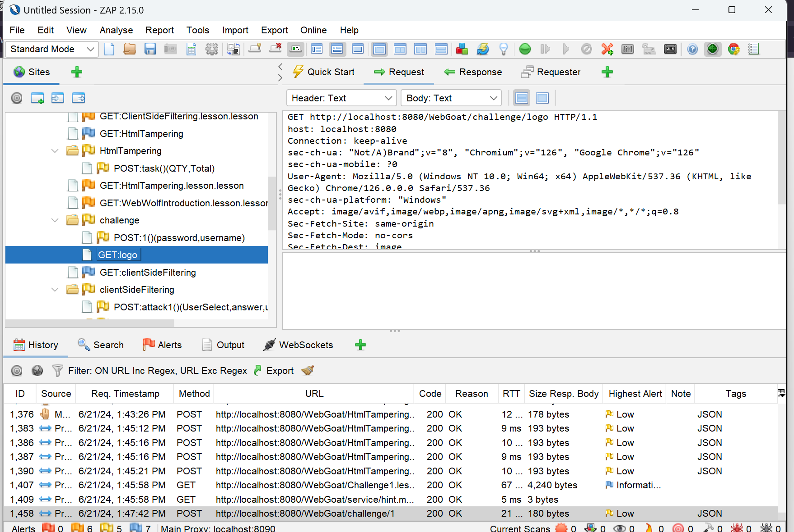
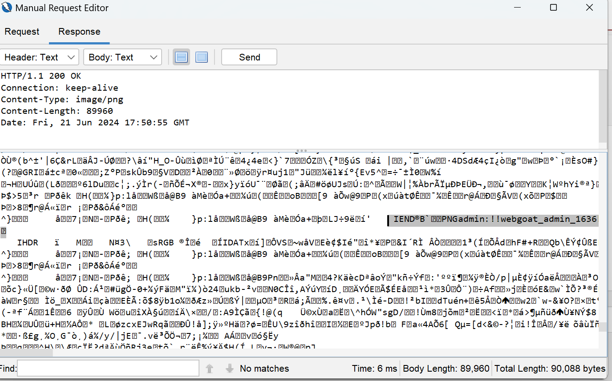

# Challenges | Admin Lost Password | Cycubix Docs

#### Welcome to the WebGoat challenge (CTF) 

**Introduction**

The challenges contain more a CTF like lessons where we do not provide any explanations what you need to do, no hints will be provided. You can use these challenges in a CTF style where you can run WebGoat on one server and all participants can join and hack the challenges. A scoreboard is available at [scoreboard](http://localhost:8080/WebGoat/scoreboard)

In this CTF you will need to solve a couple of challenges, each challenge will give you a flag which you will\
need to post in order to gain points.

Flags have the following format: `a7179f89-906b-4fec-9d99-f15b796e7208`

**Rules**

* Do not try to hack the competition infrastructure. If you happen to find a bug or vulnerability please send us\
  an e-mail.
* Play fair, do not try sabotage other competing teams, or in any way hindering the progress of another team.
* Brute forcing of challenges / flags is not allowed.

**Have fun!!**\
Team WebGoat

<figure><figcaption></figcaption></figure>

<figure><figcaption></figcaption></figure>

**Solution**

* Open ZAP or BurpSuite and intercept the request. 

<figure><figcaption></figcaption></figure>

* Send the request to the Manual Request Editor (ZAP) or the Repeater (BURP). 
* Press send: 

<figure><figcaption></figcaption></figure>

* Change the response from image to text: 

 

<figure><figcaption></figcaption></figure>

* Submit into WebGoat the corresponding information for username and password: 

<figure><figcaption></figcaption></figure>
