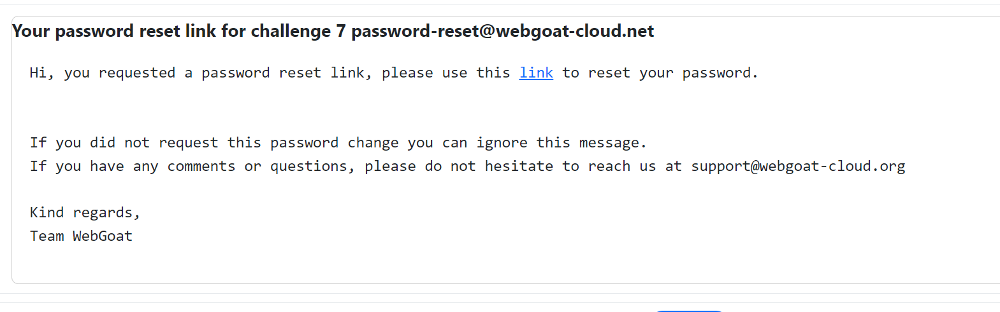

# Challenges | Admin Password Reset | Cycubix Docs

Try to reset the password for admin.

<figure><figcaption></figcaption></figure>

**Solution**

* Send yourself and email thorugh WebWolf ([http://localhost:9090/WebWolf](http://localhost:9090/WebWolf)).  

<figure><figcaption></figcaption></figure>

* The link you receive should have the following format: [http://localhost:8080/WebGoat/challenge/7/reset-password/867ef18bf000c0195c83161caf758c19](http://localhost:8080/WebGoat/challenge/7/reset-password/867ef18bf000c0195c83161caf758c19)
* What we need to find is the Hash Value. We can examine the source code.  It is better to download the zip source code: [https://github.com/WebGoat/WebGoat/releases](https://github.com/WebGoat/WebGoat/releases)
* You will see that there is a static admin password link: 

<figure><figcaption></figcaption></figure>

* Now, go into the solutions constante page: [https://github.com/WebGoat/WebGoat/blob/eed0feed061293e3c3f9d21ff672b68b55fc5e5d/webgoat-lessons/challenge/src/main/java/org/owasp/webgoat/challenges/SolutionConstants.java](https://github.com/WebGoat/WebGoat/blob/eed0feed061293e3c3f9d21ff672b68b55fc5e5d/webgoat-lessons/challenge/src/main/java/org/owasp/webgoat/challenges/SolutionConstants.java)

<figure><figcaption></figcaption></figure>

* Compose the link according to the above information: 

[http://localhost:8080/WebGoat/challenge/7/reset-password/867ef18bf000c0195c83161caf758c19](http://localhost:8080/WebGoat/challenge/7/reset-password/867ef18bf000c0195c83161caf758c19)

Replace with the hash value: 

<figure><figcaption></figcaption></figure>

