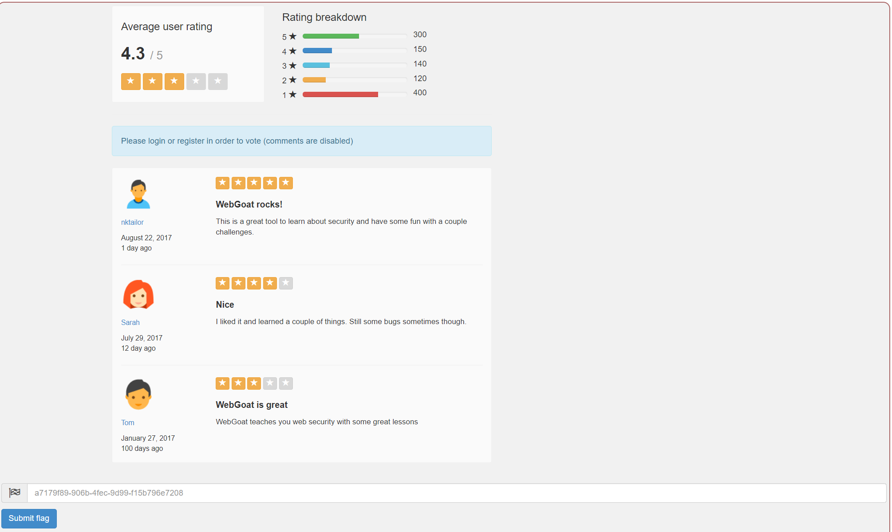

# Challenges | Without Account | Cycubox Docs

Can you still vote?

<figure><figcaption></figcaption></figure>

**Solution**

* Try to change the average rating and intercept the request with ZAP or BURP. 

<figure><figcaption></figcaption></figure>

* As we intercept the request we can try with different request method and examine the response. 

<figure><figcaption></figcaption></figure>

We can see that the POST method is not a supported exception. We can try with other methods to see if there is an exception that is supported. 

* The HEAD method returns the Flag. 

<figure><figcaption></figcaption></figure>

