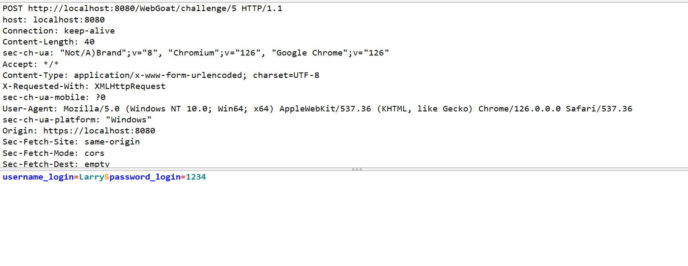

# Challenges | Without password | Cycubix Docs

Can you login as Larry?

[LOGIN](http://localhost:8080/WebGoat/start.mvc?username=luzclarita7)

<figure><figcaption></figcaption></figure>

**Solution**

* Intercept the request with ZAP or Burp.&#x20;

<figure><figcaption></figcaption></figure>

<figure><figcaption></figcaption></figure>

* If we modified the password we will get a responde saying there is a Java SQL Exception.&#x20;

<figure><figcaption></figcaption></figure>

<figure><figcaption></figcaption></figure>

* We will see from the Java SQL exception that we have a SQL Injection. We will try to change the password accordingly.&#x20;
* We can use the 'OR' statement to manipulate and have a true return, therefore bypassing authentication checks.&#x20;

<figure><figcaption></figcaption></figure>

<figure><figcaption></figcaption></figure>
