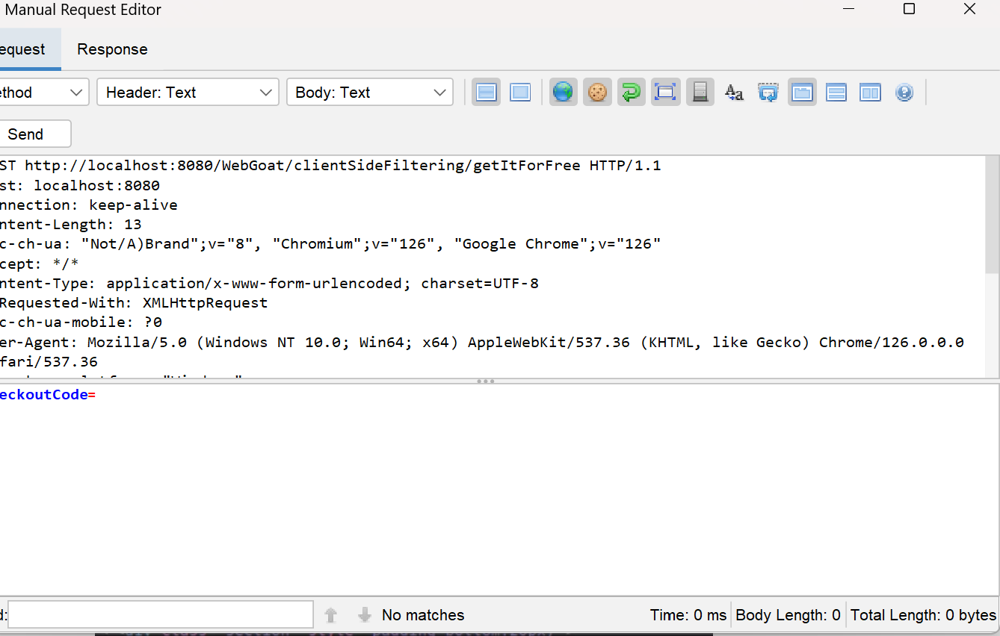

# Client Side | Client Side Filtering (3) | Cycubix Docs

No need to pay if you know the code …​

<figure><figcaption></figcaption></figure>

**Solution**

* Let's intercept the request with ZAP and see what we can find about the checkout code.&#x20;

<figure><figcaption></figcaption></figure>

* If we open the developer tools we will see that there are some checkout code's but they do not work.&#x20;

<figure><figcaption></figcaption></figure>

* Let's see what the source code say at [https://github.com/WebGoat/WebGoat/blob/main/src/main/java/org/owasp/webgoat/lessons/clientsidefiltering/ClientSideFilteringFreeAssignment.java](https://github.com/WebGoat/WebGoat/blob/main/src/main/java/org/owasp/webgoat/lessons/clientsidefiltering/ClientSideFilteringFreeAssignment.java)

```
package org.owasp.webgoat.lessons.clientsidefiltering;
import org.owasp.webgoat.container.assignments.AssignmentEndpoint; import org.owasp.webgoat.container.assignments.AssignmentHints; import org.owasp.webgoat.container.assignments.AttackResult; import org.springframework.web.bind.annotation.PostMapping; import org.springframework.web.bind.annotation.RequestParam; import org.springframework.web.bind.annotation.ResponseBody; import org.springframework.web.bind.annotation.RestController;
/**
@author nbaars
@since 4/6/17. */ @RestController @AssignmentHints({ "client.side.filtering.free.hint1", "client.side.filtering.free.hint2", "client.side.filtering.free.hint3" }) public class ClientSideFilteringFreeAssignment extends AssignmentEndpoint {
public static final String SUPER_COUPON_CODE = "get_it_for_free";
@PostMapping("/clientSideFiltering/getItForFree") @ResponseBody public AttackResult completed(@RequestParam String checkoutCode) { if (SUPER_COUPON_CODE.equals(checkoutCode)) { return success(this).build(); } return failed(this).build(); } }
```

* We can see there is a SUPER\_COUPON\_CODE="get\_it\_for\_free".&#x20;

<figure><figcaption></figcaption></figure>
