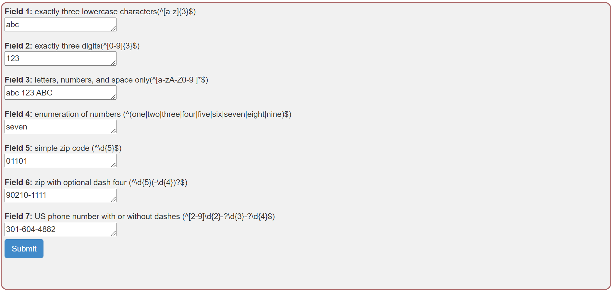
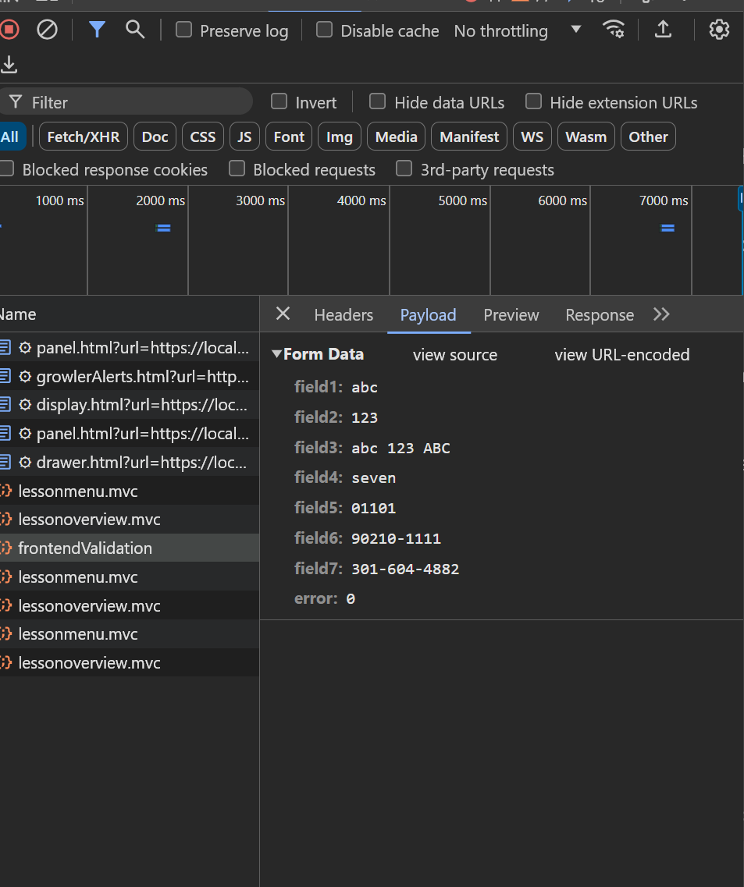
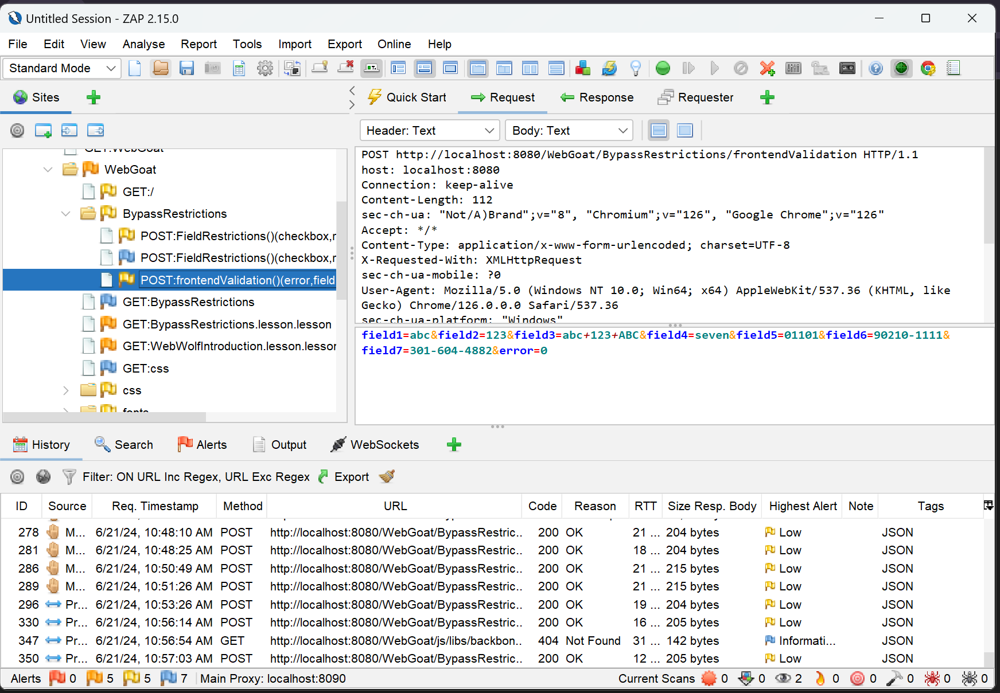

# Client Side | Bypass Front End Restrictions (3) | Cycubix Docs

### Validation <a href="#validation" id="validation"></a>

There is often some mechanism in place to prevent users from sending altered field values to the server, such as validation before sending. Most popular browsers such as Chrome don’t allow editing scripts during runtime. We will have to circumvent the validation some other way.

#### Task <a href="#task" id="task"></a>

Send a request that does not fit the regular expression above the field in all fields.

<figure><figcaption></figcaption></figure>

Solution

* Like in the previous exercise, turn on Zap and intercept the request. We Can also see in the developer tools the client-side validation or restrictions applied to the input fields.&#x20;

<figure><figcaption></figcaption></figure>

<figure><figcaption></figcaption></figure>

* We now need to change the field value:&#x20;

```
field1=alimbc&field2=14325&field3=ab---c+123+ABC&field4=setven&field5=01101im01&field6=90im210-1111&field7=301-604im-4882&error=0
```

<figure><figcaption></figcaption></figure>

<figure><figcaption></figcaption></figure>
