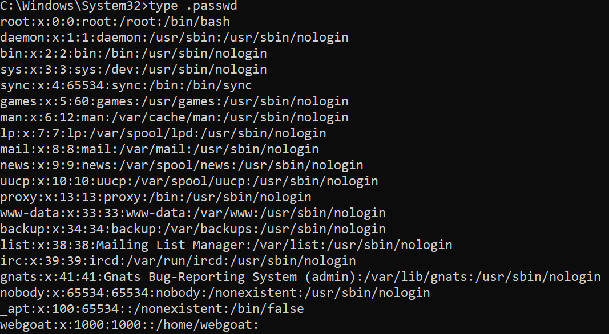

# A2:2021 | Crypto Basics (8) | Cycubix Docs

A big problem in all kinds of systems is the use of default configurations. E.g. default username/passwords in routers, default passwords for keystores, default unencrypted mode, etc.

### Java cacerts <a href="#java_cacerts" id="java_cacerts"></a>

Did you ever _**changeit**_? Putting a password on the cacerts file has some implications. It is important when the trusted certificate authorities need to be protected and an unknown self signed certificate authority cannot be added too easily.

### Protecting your id\_rsa private key <a href="#protecting_your_id_rsa_private_key" id="protecting_your_id_rsa_private_key"></a>

Are you using an ssh key for GitHub and or other sites and are you leaving it unencrypted on your disk? Or even on your cloud drive? By default, the generation of an ssh key pair leaves the private key unencrypted. Which makes it easy to use and if stored in a place where only you can go, it offers sufficient protection. However, it is better to encrypt the key. When you want to use the key, you would have to provide the password again.

### SSH username/password to your server <a href="#ssh_usernamepassword_to_your_server" id="ssh_usernamepassword_to_your_server"></a>

When you are getting a virtual server from some hosting provider, there are usually a lot of not so secure defaults. One of which is that ssh to the server runs on the default port 22 and allows username/password attempts. One of the first things you should do, is to change the configuration that you cannot ssh as user root, and you cannot ssh using username/password, but only with a valid and strong ssh key. If not, then you will notice continuous brute force attempts to login to your server.

### Assignment <a href="#assignment" id="assignment"></a>

In this exercise you need to retrieve a secret that has accidentally been left inside a docker container image. 

With this secret, you can decrypt the following message: **U2FsdGVkX199jgh5oANElFdtCxIEvdEvciLi+v+5loE+VCuy6Ii0b+5byb5DXp32RPmT02Ek1pf55ctQN+DHbwCPiVRfFQamDmbHBUpD7as=**. 

You can decrypt the message by logging in to the running container (docker exec …​) and getting access to the password file located in /root. Then use the openssl command inside the container (for portability issues in openssl on Windows/Mac/Linux) You can find the secret in the following docker image, which you can start as:

With this secret, you can decrypt the following message: **U2FsdGVkX199jgh5oANElFdtCxIEvdEvciLi+v+5loE+VCuy6Ii0b+5byb5DXp32RPmT02Ek1pf55ctQN+DHbwCPiVRfFQamDmbHBUpD7as=**. 

You can decrypt the message by logging in to the running container (docker exec …​) and getting access to the password file located in /root. Then use the openssl command inside the container (for portability issues in openssl on Windows/Mac/Linux) You can find the secret in the following docker image, which you can start as:

```
docker run -d webgoat/assignments:findthesecret
```

<pre><code><strong>echo "U2FsdGVkX199jgh5oANElFdtCxIEvdEvciLi+v+5loE+VCuy6Ii0b+5byb5DXp32RPmT02Ek1pf55ctQN+DHbwCPiVRfFQamDmbHBUpD7as=" | openssl enc -aes-256-cbc -d -a -kfile ....
</strong></code></pre>

<figure><figcaption></figcaption></figure>

**Solution**

* Hints: After starting the docker container enter the container using docker exec -ti _dockerid_ /bin/bash. Try to gain access to /root. Try to become user root by su -. Try to change the /etc/shadow file using docker cp. 
* Find your container ID. 

```
// docker --version
```

```
// docker run -d --name findthesecret webgoat/assignments:findthesecret
```

* The output will tell you docker container ID.
* Once you have the ID access your to WebGoat Shell. 

```
// docker exec -it #your container ID# /bin/bash
// webgoat@container id: /$ apt-get update
```

* Try to find a path to the password located in root. 

```
// webgoat@containerid:/$ cd/ 
// webgoat@containerid:/ $ cd/root
// bash: cd> /root: Permission denied
```

* You can see that the permission was denied. 
* Try to find which files are in the Root Directory instead. 

```
// webgoat@containerid:/$ cd
// webgoat@containerid: ~ cd/etc
// webgoat@containerid:/etc$ ls-la

```

* And explore the files, looking for the file password. Output is detailed in image below. 

<figure><figcaption></figcaption></figure>

* Exit webgoat shell and copy the file passwd into your own system. The output should be" successfully copied into your windows. 

```
// C\Windows\System32>docker cp containerid:/etc/passwd .passwd
```

* Explore the file with passwords. 

<figure><figcaption></figcaption></figure>

Check in the image above that root has the following password: 0:0, whilw WebGoat has 1000:1000 as password. 

* In order to change the password of WebGoat into the Root password, open the PowerShell and copy the following script: 

```
# Path to the .passwd file
$filePath = "C:\Windows\System32\.passwd"

# Read the content of the file
$content = Get-Content $filePath

# Modify the webgoat line
$modifiedContent = $content -replace 'webgoat:x:1000:1000:', 'webgoat:x:0:0:'

# Write the modified content back to the file
$modifiedContent | Set-Content $filePath

# Verify the changes
Get-Content $filePath

```

* Once you execute it, you will see the change in Webgoat's password. 

<figure><figcaption></figcaption></figure>

* To confirm that the execution is correct, execute the following commands on PowerShell: 

```
// PS C:\Windows\System32> Get-Content .passwd
```


* Send the modified file to the original directory in Docker. 

```
// docker cp C:\Windows\System32\.passwd 7ed4a43b4cb4e67bc23dab0cdd578cf806a951f41d18ec00c773c4939e5d97dd:/etc/passwd
```

* Access docker container again. You will see that we have access to the root directory. 

```
// docker exec -it 7ed4a43b4cb4e67bc23dab0cdd578cf806a951f41d18ec00c773c4939e5d97dd /bin/bash
```

* Now we try to find the password and the name of the file that stores the password. 

<figure><figcaption><p>\</p></figcaption></figure>

* Also, if we copy the encrypted message into our Shell, and add at the end the file default\_secret we will be able to decrypt the message. 

```
// echo "U2FsdGVkX199jgh5oANElFdtCxIEvdEvciLi+v+5loE+VCuy6Ii0b+5byb5DXp32RPmT02Ek1pf55ctQN+DHbwCPiVRfFQamDmbHBUpD7as=" | openssl enc -aes-256-cbc -d -a -kfile
```

<figure><figcaption></figcaption></figure>

* Now go ahead and submit your answer to WebGoat. 

<figure><figcaption></figcaption></figure>

**Troubleshooting**

* Despite changing the `webgoat` user's UID and GID to `0` in the `/etc/passwd` file, you are still seeing the user as `webgoat` and not as `root`. This might indicate that the change was not applied correctly or there is some other issue.
* Your will need to Verify Changes in `/etc/passwd`**.** 
* Open the Docker container shell and type: 

```
cat /etc/passwd | grep webgoat
```

* If you receive the following output then the changes are made: 

```
webgoat:x:0:0::/home/webgoat:/bin/bash
```

If you are still seeing webgoat under passwords 1000:1000, it is recommended to exit the shell, and restart the docker container shell: 

```
docker exec -it 7ed4a43b4cb4e67bc23dab0cdd578cf806a951f41d18ec00c773c4939e5d97dd /bin/bash
```
