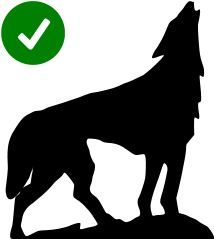

# WebWolf | Web Application Security | Cycubix Docs

You only need WebWolf if you a lesson specifies you can use it. For a lot of lessons you use WebGoat without starting WebWolf. If you need to do an exercise with WebWolf make sure it is running along side with WebGoat. Lessons where you can use WebWolf are marked with the following icon (top right in assignment):

Even if the icon is present your are not obliged to use WebWolf, you can also use any intercepting tool you like, like [`ncat`](https://nmap.org/ncat/) etc. Ncat is a feature-packed networking utility which reads and writes data across networks from the command line. Ncat was written for the Nmap Project as a much-improved reimplementation of the venerable [Netcat](https://sectools.org/tool/netcat/). 

You can always open WebWolf by clicking the icon in the top right corner.

WebWolf opens in a new browser tab as a separate web application simulating an attacker’s machine. It allows us to differentiate between activities on the attacked website and actions needed by the "attacker." WebWolf was developed following workshops where feedback highlighted the need to clearly separate the roles of "attacker" and "user" on the site. WebWolf supports the following features:

* Hosting a file.
* Receiving email.
* Landing page for incoming requests.

### Further training

Visit [**Cycubix.com**](https://cycubix.com/) to find out more about our [Application Security training courses](https://cycubix.com/training/). We also offer [(ISC)² Official training for CISSP, SSCP, CCSP and CSSLP certifications](https://cycubix.com/training/).
